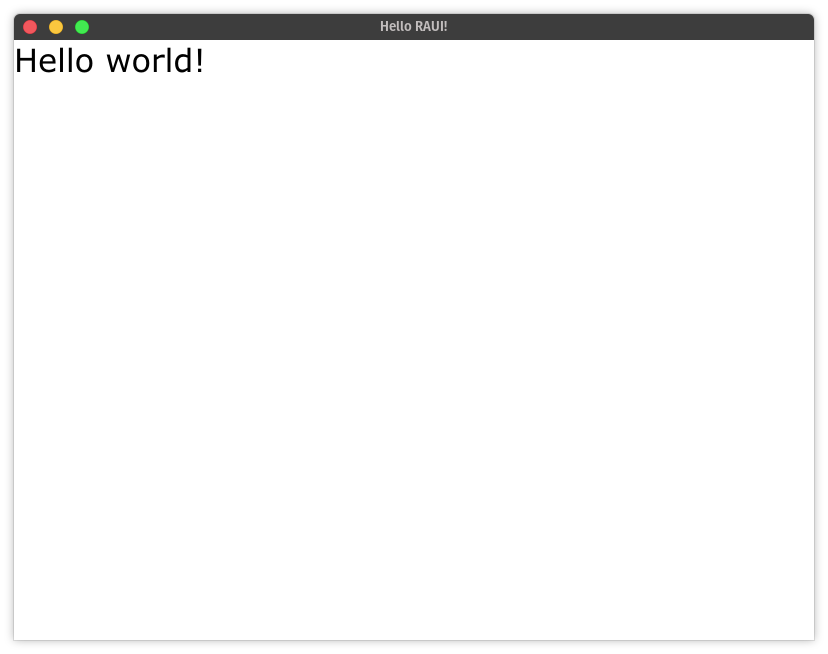

# Your First Component

Now we are going to create our own RAUI widget component. Before we do that, though, let's explain what the different kinds of widgets are in RAUI.

## Widget Types

There are three different kinds of widgets in RAUI:

### `WidgetNode`'s

A `WidgetNode` represents any kind of widget in RAUI: `None`, `WidgetUnit`, or `Widgetcomponent`. `WidgetNode`'s can be used to represent entire _widget trees_ because the `WidgetUnit`'s and `WidgetComponent`'s inside of them can each contain other `WidgetUnit`'s or `WidgetComponents`'s as children.

### `WidgetUnit`'s

`WidgetUnit`'s are primitive widgets such as `TextBox`, `ImageBox`, or `FlexBox`. There are a small number of different kinds of `WidgetUnit`'s and it is the job of the RAUI rendering backend to be able to render the differnt kinds of `WidgetUnit`'s. They are the building-blocks for more complicated components.

### `WidgetComponent`'s

`WidgetComponent`'s are made out of functions that process their properties and child nodes and use that information to return a new `WidgetNode`. The returned `WidgetNode` can in turn be made up of other `WidgetComponent`'s or `WigetUnit`'s. This allows you to use components to compose other components and widget units together to create complicated UIs out of small, modular components.

## Writing a Component

Now let's write our first component! Let's create a new module to put our UI code in:

**`ui.rs`:**

```rust
// Include the RAUI prelude
use raui::prelude::*;

/// We create our own widget by making a function that takes a `WidgetContext`
/// and that returns `WidgetNode`.
pub fn my_first_widget(_ctx: WidgetContext) -> WidgetNode {
    // We may do any amount of processing in the body of the function.

    // For now we will simply be creating a text box properties struct that we
    // will use to configure the `text_box` component.
    let text_box_props = TextBoxProps {
        text: "Hello world!".to_owned(),
        color: Color {
            r: 0.0,
            g: 0.0,
            b: 0.0,
            a: 1.0,
        },
        font: TextBoxFont {
            name: "verdana".to_owned(),
            size: 32.0,
        },
        ..Default::default()
    };

    // And at the end of the function we return a `WidgetNode` which we can
    // conveniently create with the `widget!` macro.
    widget! {
        (text_box: {text_box_props})
        // ^          ^
        // |          |
        // |          ---- After the name of the widget component we pass in
        // |               the component properties.
        // |
        // --- This is the name of the `text_box` widget component, which is a
        //     part of the RAUI prelude
    }
}
```

Then back in `main.rs` we need to include our new `ui` module:

**`main.rs`:**

```rust
// Above fn main() { ... }
mod ui;
use ui::my_first_widget;
```

And we need to add our widget to the widget tree we created in our `App::new` function:

**`main.rs`:**

```rust
impl App {
    fn new(context: &mut tetra::Context) -> Result<Self, tetra::TetraError> {
        // This is where we pass in our actual RAUI widget tree, specifying the
        // whole RAUI UI. The widget! macro is used to create widget nodes that
        // are used to represent widget trees.
        // 
        // Here we create a widget node with `my_widget` as the only component in
        // it.
        let tree = widget! {
            (my_first_widget)
        };

        // ...
    }
}
```

Now when you `cargo run` you should see your very first widget saying "Hello World!".

