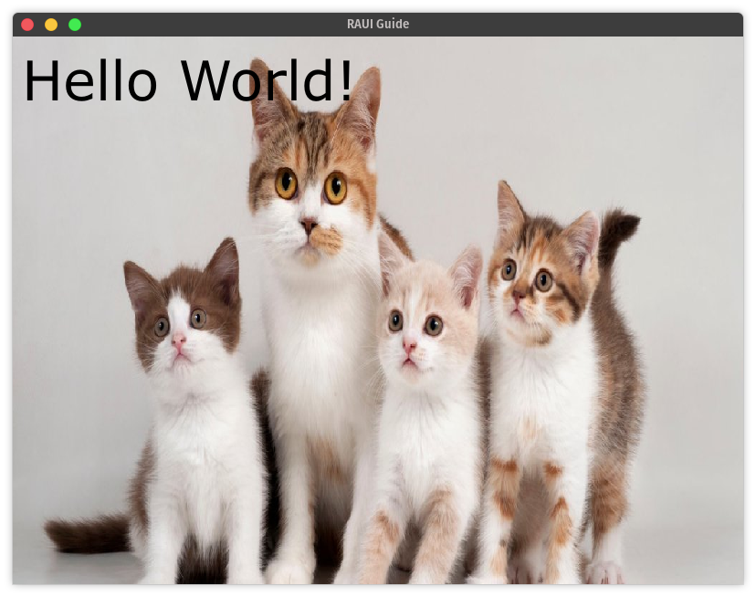

+++
title = "Containers"
description = "Learn how to use container widgets."
draft = false
weight = 3
template = "docs/page.html"
slug = "containers"

[extra]
lead = "Now we're going to try out some built-in container widgets that will allow us to organize our content and build layouts."
toc = true
top = false
+++

RAUI comes with a number of built-in container components that can be used to help group and lay out other components. You can find the list of core container types in the [API documentation][containers].

[containers]: https://docs.rs/raui/latest/raui/core/widget/component/containers/index.html

## Content Box

The first container we'll look at is the [`content_box`]. Content boxes are simple containers that can hold multiple items, where each item's position is **not** effected by any of the other items in the box.

A couple useful features of [`content_box`]s are that they can have a [transform][`contentboxprops::transform`] applied to them to scale, position, rotate, etc. the box and everything in it, and items inside them can specify [layout attributes][`contentboxitemlayout`] such as margin, alignment, and anchor.

> **Note:** A content box's transform is purely a _visual_ effect and has no effect on the layout of the box or the regions used to detect clicks, hovers, etc. for the box or it's children. It is used primarily in animations and visual effects, not for general purpose positioning.

In our demo app we've been working on, let's put our text in a content box so that we can set a small margin around our text.

[`contentboxitemlayout`]: https://docs.rs/raui/latest/raui/core/widget/unit/content/struct.ContentBoxItemLayout.html
[`contentboxprops::transform`]: https://docs.rs/raui/latest/raui/core/widget/component/containers/content_box/struct.ContentBoxProps.html#structfield.transform
[`content_box`]: https://docs.rs/raui/latest/raui/core/widget/component/containers/content_box/fn.content_box.html



```rust
# use raui::import_all::*;
/// Our app widget from earlier
pub fn app(_ctx: WidgetContext) -> WidgetNode {
    // Create our text box properties
    let text_box_props = Props::new(TextBoxProps {
        text: "Hello World!".into(),
        color: Color {
            r: 0.0,
            g: 0.0,
            b: 0.0,
            a: 1.0,
        },
        font: TextBoxFont {
           // We specify the path to our font
            name: "resources/verdana.ttf".to_owned(),
            size: 60.0,
        },
        // Use the defaults for the rest of the text box settings
        ..Default::default()
    })
    // Here we use the `with` function on `Props` _add_ to another property to our
    // text box props list. In this case we add the `ContentBoxItemLayout` struct to
    // influence its layout when it is a child of a `content_box`.
    .with(ContentBoxItemLayout {
        // Specify a margin of 10 on every side
        margin: 10.0.into(),
        // Use the default value for the rest of the layout options
        ..Default::default()
    });

    make_widget!(content_box)
        .listed_slot(make_widget!(text_box).merge_props(text_box_props))
        .into()
}
```



Now if we run our app we should have a small margin between the text and the sides of the window.

But what if we want to add another item to our box, like maybe an image? Let's see what happens if we place an image in the content box with our text:



```rust
# use raui::import_all::*;
pub fn app(_ctx: WidgetContext) -> WidgetNode {
    // Create our text box properties
    // ...
#    let text_box_props = Props::new(TextBoxProps {
#        text: "Hello World!".into(),
#        color: Color {
#            r: 0.0,
#            g: 0.0,
#            b: 0.0,
#            a: 1.0,
#        },
#        font: TextBoxFont {
#            // We specify the path to our font
#            name: "resources/verdana.ttf".to_owned(),
#            size: 60.0,
#        },
#        // Use the defaults for the rest of the text box settings
#        ..Default::default()
#    })
#    .with(ContentBoxItemLayout {
#        // Specify a margin of 10 on every side
#        margin: 10.0.into(),
#        // Use the default value for the rest of the layout options
#        ..Default::default()
#    });

    // Create the props for our image
    let image_box_props = Props::new(ImageBoxProps {
        // The material defines what image or color to use for the box
        material: ImageBoxMaterial::Image(ImageBoxImage {
            // The path to our image
            id: "resources/cats.jpg".to_owned(),
            ..Default::default()
        }),
        // Have the image fill it's container
        width: ImageBoxSizeValue::Fill,
        height: ImageBoxSizeValue::Fill,
        ..Default::default()
    });

    make_widget!(content_box)
        .listed_slot(make_widget!(image_box).merge_props(image_box_props))
        .listed_slot(make_widget!(text_box).merge_props(text_box_props))
        .into()
}
```





> **Note:** You can download the demo cat image [here](https://github.com/PsichiX/raui/raw/master/site/rust/guide_03/resources/cats.jpg).

Notice that the content box didn't make sure there was any "room" for the text or the image to sit side-by-side with each-other, it just stacked them right on top of each-other. Also

If we wanted to have them line up without overlapping we would use a [`flex_box`].

[`flex_box`]: https://docs.rs/raui/latest/raui/core/widget/component/containers/flex_box/fn.flex_box.html

## Flex Box

Flex boxes in RAUI are similar to [CSS flexboxes][css_flexboxes]. Flex boxes lay things out in a row or a column depending on whether or not their _direction_. For convenience, RAUI has [`vertical_box`] and [`horizontal_box`] components that are simply [`flex_box`] component with their direction set to vertical or horizontal by default.

> **Note:** For a more in-depth explanation of how layout works in RAUI see [Layout in Depth](../../layout/layout-in-depth).

[css_flexboxes]: https://www.w3schools.com/css/css3_flexbox.asp
[`horizontal_box`]: https://docs.rs/raui/latest/raui/core/widget/component/containers/horizontal_box/fn.horizontal_box.html
[`vertical_box`]: https://docs.rs/raui/latest/raui/core/widget/component/containers/vertical_box/fn.vertical_box.html

Let's go ahead and use a [`vertical_box`] to put our text above our cat photo:



```rust
# use raui::import_all::*;
pub fn app(_ctx: WidgetContext) -> WidgetNode {
    // Create our text box properties
    let text_box_props = Props::new(TextBoxProps {
        text: "Hello World!".into(),
        color: Color {
            r: 0.0,
            g: 0.0,
            b: 0.0,
            a: 1.0,
        },
        font: TextBoxFont {
            // We specify the path to our font
            name: "resources/verdana.ttf".to_owned(),
            size: 60.0,
        },
        // Use the defaults for the rest of the text box settings
        ..Default::default()
    })
    // Notice that we now use a `FlexBoxItemLayout` instead of a `ContentBoxItemLayout`
    // because we are putting it in a flex box instead of a content box
    .with(FlexBoxItemLayout {
        margin: Rect {
            // Let's just set a left margin this time
            left: 30.,
            ..Default::default()
        },
        ..Default::default()
    });

    // Create the props for our image
    let image_box_props = Props::new(ImageBoxProps {
        material: ImageBoxMaterial::Image(ImageBoxImage {
            id: "resources/cats.jpg".to_owned(),
            ..Default::default()
        }),
        ..Default::default()
    });

    // Use a vertical_box instead of a content_box
    make_widget!(vertical_box)
        // Now because the text and image won't overlap, let's put
        // the text above the image
        .listed_slot(make_widget!(text_box).merge_props(text_box_props))
        .listed_slot(make_widget!(image_box).merge_props(image_box_props))
        .into()
}
```




There we go! Notice that with the flex box layout, the text box and the image box are both taking up an equal amount of space vertically. That's how flex boxes work by default. Each item in the box will get an equal amount of space along the flex box's direction. This is configurable using the other settings in the [`FlexBoxItemLayout`] struct.

[`flexboxitemlayout`]: htps://docs.rs/raui/latest/raui/core/widget/unit/flex/struct.FlexBoxItemLayout.html

Next we'll learn how to make our UI react to user input.

> **Note:** You can access the full source code for this chapter [here](https://github.com/RAUI-labs/raui/tree/master/site/rust/guide_03).

## 🚧 Under Construction 👷

There should be more to this guide but it isn't written yet! If you've gotten this far, congratulations and thank you for reading! Come back later and see whether or not more of the guide has been written.

If you need help or have questions, feel free to open up a [discussion] on GitHub. 👋

[discussion]: https://github.com/PsichiX/raui/discussions
